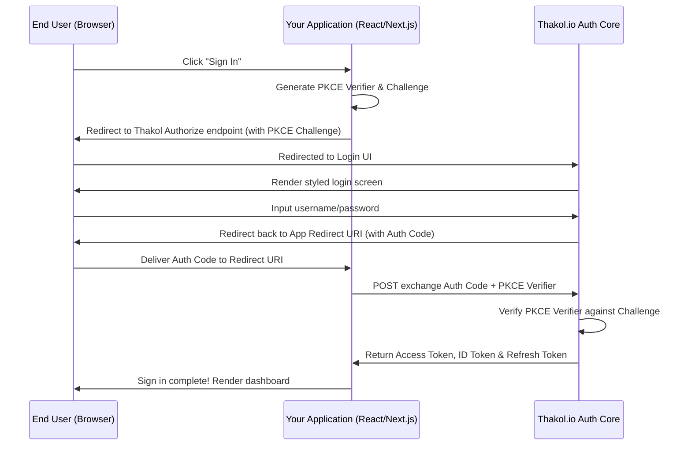

# How Thakol Works & OIDC Core

Thakol is built entirely on standard OpenID Connect (OIDC) and OAuth 2.0 specifications. This means you do not need proprietary libraries or SDKs to integrate authentication. Any library that supports standard OIDC can talk to Thakol.

---

## 🔄 The Authentication Flow

For modern applications (Single Page Apps, Mobile Apps, Server-side Web Apps), Thakol utilizes the **Authorization Code Flow with PKCE** (Proof Key for Code Exchange). This is the industry-standard secure authentication flow.

### Step-by-Step Flow:

1. **Initiation**: The user clicks "Login" in your app. Your app generates a cryptographically secure random string called the `code_verifier`, and hashes it to create the `code_challenge`.
2. **Redirection**: Your app redirects the user's browser to the Thakol Authorize URL, passing your **Client ID**, your registered **Redirect URI**, and the `code_challenge`.
3. **Authentication**: The user registers or signs in on Thakol's hosted white-labeled login page.
4. **Callback**: Upon success, Thakol redirects the user back to your app's **Redirect URI**, passing a temporary `code` in the URL query string.
5. **Token Exchange**: Your application intercepts this code and makes a background HTTP POST request to Thakol's Token endpoint, passing the `code` and the original plain `code_verifier`.
6. **Validation & Response**: Thakol verifies that the verifier matches the original challenge. It returns a set of JSON Web Tokens (JWTs):
   * **ID Token**: Contains the user's profile claims (name, email, unique ID).
   * **Access Token**: A cryptographically signed JWT proving the user is logged in, used to authorize API requests.
   * **Refresh Token**: Used to fetch new tokens silently when they expire, without prompting the user.

---

## 📊 Comparison Matrix

Here is how Thakol compares to other solutions:

| Feature / Dimension | Thakol.io | Clerk | Vanilla Keycloak |
| :--- | :--- | :--- | :--- |
| **Base Core** | Battle-tested Keycloak Core | Proprietary Closed-source | Open-source (self-hosted) |
| **Pricing** | **Pay-As-You-Go** ($0.10 / 100 logins) | Expensive MAU Tiers | Free (high hosting & admin costs) |
| **Vendor Lock-in** | **None** (Uses standard OIDC) | **High** (Proprietary SDKs) | **None** (Uses standard OIDC) |
| **JIT Migrator** | **Included** (Simple Dashboard sync) | Limited / Manual imports | Requires compiling custom Java SPI |
| **Theme Editor** | **Live preview** & dynamic overlays | Paid Addons / Watermarks | Requires writing raw HTML files |
| **Ops Overhead** | **Zero** (Serverless hosting) | Zero (SaaS hosting) | **High** (JVM tuning, DB ops, SSL certs) |
